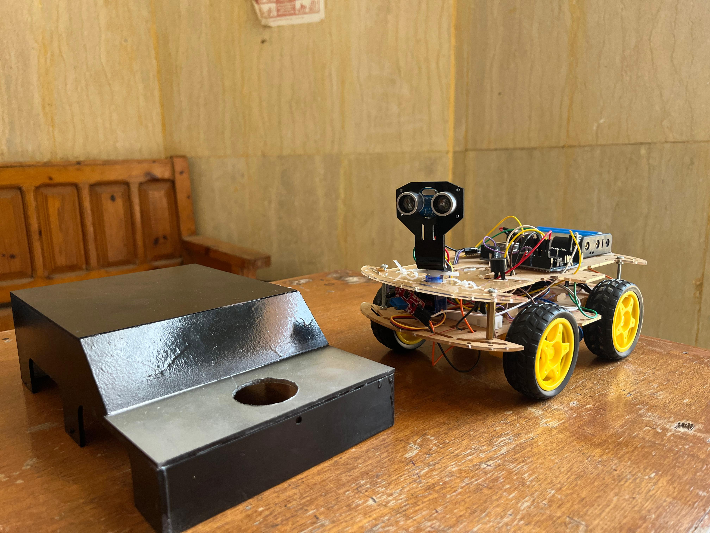
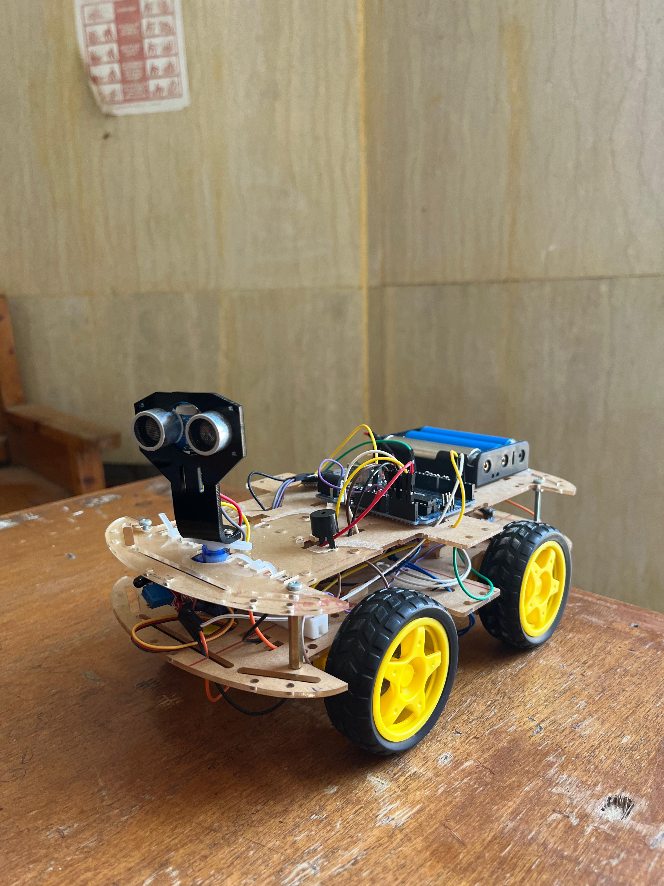
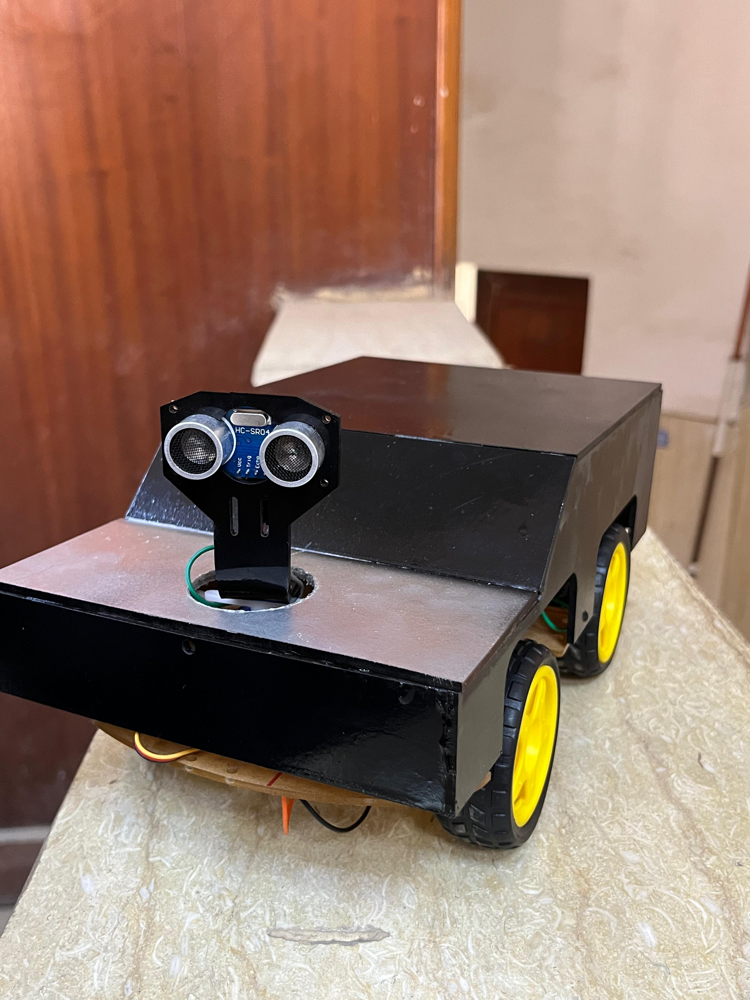
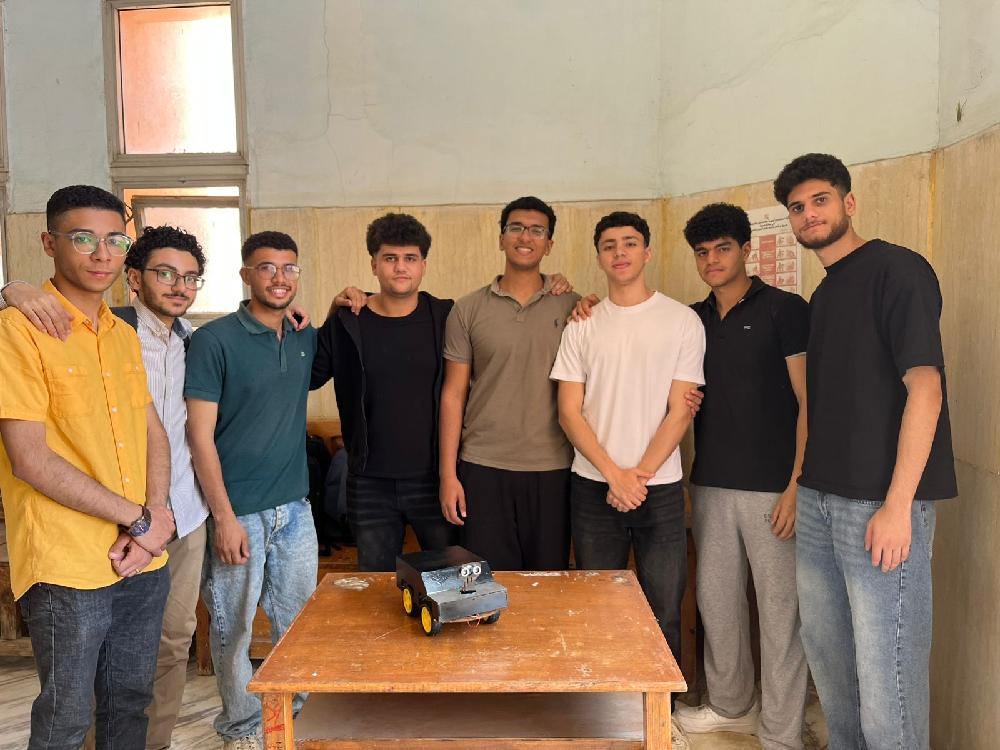
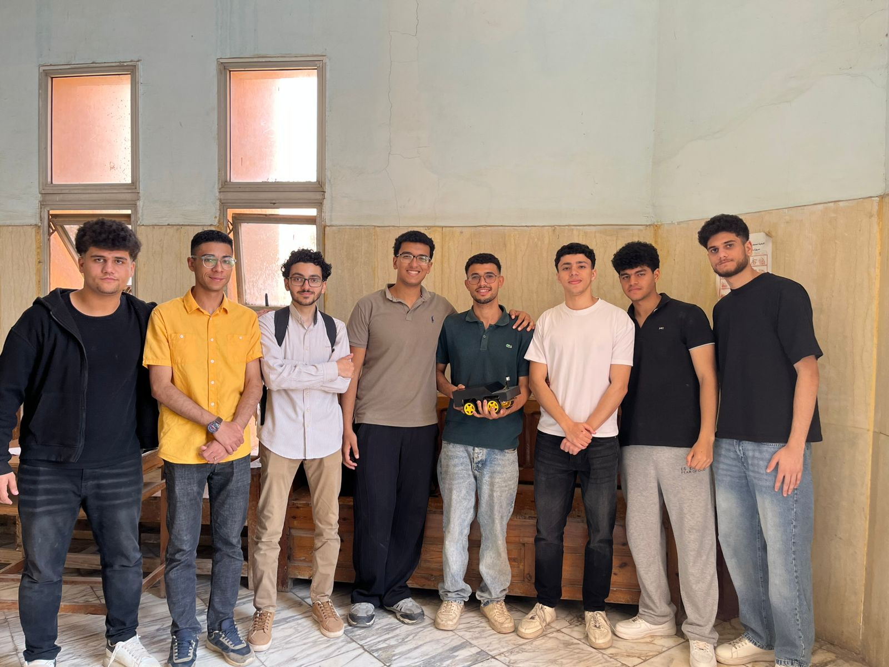

# Autonomous and Controlled Car by Arduino

Fire-detecting autonomous car built with Arduino as a university project at Menoufia University - Electrical & Computer Engineering Department.

## Project Description
A smart car that can detect fire using a flame sensor and navigate autonomously using ultrasonic sensor for obstacle avoidance. Can also be controlled manually via Bluetooth.

## Components
- Arduino Uno
- Flame Sensor
- Ultrasonic Sensor
- Servo Motor
- Bluetooth Module (HC-05)
- Motor Driver (L298N)

## My Role
- Team Leader
- Code Developer (wrote all the code)

## Project Poster

## Project Photos

## Demo Video
[Watch on YouTube ](https://youtu.be/6vy3CGgfz5A?si=ZZa4Zn-DjcI-DSjj )
